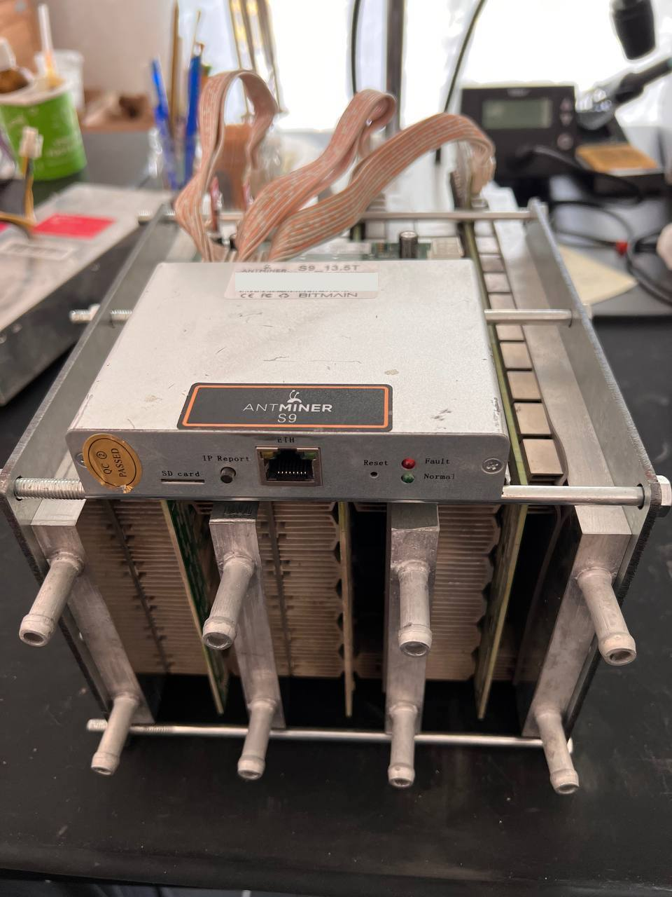

# Bitcoin-Heater-with-Antminer-S9
Conversion of an Antminer S9 to a Bitcoin heater (Heißluft).

## Vorwort

Die Idee hinter einer Heizung basierend auf die Abwärme von Computer-Technik, ist wahrscheinlich genau so alt wie der Computer selbst. In diesem Tutorial werden wir einen Antminer S9 von Bitmain (Asic Miner) zu einem leisen Heizgerät umbauen. 

## Wie siehst es fertig aus?

## Technische Eckdaten

Verbrauch: 180 - 1600 Watt  - PSU / Netzteil details: [HIER](./PSU_APW3pp.md) 
Hash-Power: 14TH/s 
Abwärme: ca. 40°C 
Internet: ETH Port

## Grundvorraussetzung

- Wechselstrom Strom ab 180Watt bei 220-240Volt
- Passendes Netzteil. Alternativ können die Hashboards und das Control Board direkt über DC versorgt werden, z.b. mit einem handelsüblichen PC Netzteil oder DC stabilized power supply.
- Internet (3G, LTE, SAT) und einen freien ETH Netzwerkport, muss stabil sein - nicht schnell. Verbrauch ca. 300MB-500MB pro Monat.

## Benötigte Bauteile und Werkzeuge

- Einen Antminer S7 S9 S9i M3 V9 D3 A3 or T9+ mit funktionsfähigem Netzteil
- 2x Stahlplatten
- 4x Wasserkühlblock
- 2x Wasserverteiler (1 zu 4)
- 6x Thermo Pads
- 25 x Klammern
- 1 x Wasserpumpe
- 1 x Radiator 480
- 8 x Fans
- 8 x Fan Abdeckung
- 2 set Fan PWD Erweiterungskabel
- 6 x lange Schrauben
- 1 x Teflonband (klein?!)
- 5L High Performance Dielectric Heat Transfer Fluid ODER 5L Destilliertes Wasser 
- Thermo Schlauch: 5 meters
- Kleinkram (todo)

### Schritt 1 - Miner prüfen.

Prüft den Miner auf Funktionsfähigkeit und ob auch alle Hashboards laufen. Das System funktioniert bereits ab einem funktionsfähigem Hasboard. 

### Schritt 2 - Hashboards ausbauen

1. Erdet euch selbst gegen elektrische Aufladung. Ihr könnet ansonsten bei den nächsten Schritten den Miner ungewollt beschädigen.

2. Hinteren Lüfter abschrauben und abnehmen. Es reicht direkt die Blende / Halterung abzuschrauben. 

3. Netzteil-, Data- und Fan-Kabel abziehen. Achtet darauf, dass alle Kabel in der Regel mit einem Hebelverschluss gesichert sind. Verwendet eure Daumen oder einen Schraubenzieher, um den Verschluss durch Hochheben zu lösen und um dann das Kabel herauszuziehen. 

4. Hashboards, durch Herausziehen herausnehmen. Seid vorsichtig, grundsätzlich lassen sich die Hashboards ganz einfach herausziehen. Bei Wiederstand - guckt rein, nimmt sonst erst mal ein anderes Hashboard heraus. Legt die Boards zur Seite.
 

5. Das Control Board zieht ihr zum Schluss nun auch heraus. Achtet hier ebenfalls auf die Verschlüsse, druckt diese zur Seite und zieht das Control Board vorsichtig heraus. 

6. Die Hashboards und das Control Board vorsichtig säubern und von Staub und Dreck befreien. Ihr könnt hierfür Pressluft, weiche Pinseln, reinen Alkohol oder auch Spüli verwenden. Auch die Behandlung in einem Ultraschalbad ist denkbar und gängige Praxis. Alle gereinigten Teile müssen vollständig trocknen.

### Schritt 3 - Heater zusammenbauen

Als Erste bringen wir die Hashboards und Kühlwasserblöcke zusammen. Das Ganze sieht dann fertig so aus.

 
1. Fangt mit einen Wasserkühlblock an und legt ein Thermal Pad aus.
 
 
2. Darauf kommt dann das erste Hashboard, dann wieder ein Thermal Pad.
 
  
3. Dann der nächste Wasserkühlblock, wieder ein Pad usw. 
 

4. Das Ganze wiederholen - der Abschluss ist ein Kühlwasserblöcke.
   
   
     

5. Hashboard und Kühlwasserblöcke in die Stahlkonstruktion, bestehend aus den beiden Stahlplatte und den sechs langen Schrauben, einsetzen. Achtete darauf das die Stahlkonstruktion keine Bauelemente der Hashboards berührt. 

Glückwünsch - Du bist mit dem leichten Teil fertig :D 

### Schritt 4 - Aufbau der Schlauchstruktur

Verwendet vernünftige Klemmen, Schellen und das Teflonband!

1. Entscheidet wie weit der Radiator vom Miner stehen soll. Alle Komponenten sollten jedoch so nah wie möglich zusammen stehen. Beachtet, welches Volumen eure Pumpe hinbekommt bei 12 V. Ihr könnte das Kabel entweder nach Augenmaß zusammenschneiden oder auch abmessen. Wie auch immer, ein scharfes Teppichmesser reicht aus. Achtet darauf das die Schnitte sauber und gerade sind. Insgesamt benötigt ihr: 

8 x 40cm Thermo Schlauch 10mm A (Hashboard zum Wasserverteiler)
1 x 30cm Thermo Schlauch 10mm B (Verteiler zu Pumpe)
1 x 50cm Thermo Schlauch 10mm C (Verteiler zu Radiator)
1 x 50cm Thermo Schlauch 10mm D (Radiator zu Pumpe)

2. Verbindet die Hashboards mit den beiden Wasserverteiler. Jeder Kühlwasserblöcke hat jeweils einen Wassereingang und Wasserausgang. Legt fest welche Seite der Eingang und welche der Ausgang ist und verbindet die Schläuche entsprechend mit dem jeweilgen Wasserverteiler. 

## Schritt 5 - System mit Radiator verbinden

1. Verbindet nun einen der Wasserteiler mit dem Radiator.
2. Verbindet den freien Radiatoranschluss mit der Pumpe (IN).
3. Schließt den letzten Schlauch an den freien Wasserverteile an, aber noch nicht mit der Pumpte verbinden! Ihr werden über diesen Schlauch gleich das System mit Destilliertes Wasser / Kühlmittel. 

4. Baut die Pumpenhalterung zusammen

### Schritt 6 - Netzteil

Verwendet am besten ein PC-Netzteil, ein neues Netzteil APW3 ++ oder tauscht den Lüfter in der PSU aus. 
Wem das System trotzdem zu laut ist, kann man den Miner in einer passenden Soundbox stellen - nur der Radiator muss an die Luft. 

*Lebensgefahr !* Alternativ könnt ihr die obere Abdeckung der PSU abnehmen und die PSU dann mit einem leisen 120 mm Lüfter kühlen. Berührt bloß nichts.

### Schritt 7 - Testlauf und System mit Wasser befüllen

1. Setz das Control Board auf den Bitcoin Würfel, ihr musst unter dem Control Board etwas nicht Leitendes und Wärmebeständiges hinlegen. Die Unterseite vom Control Board darf den Würfel nicht berühren. Es besteht Kurzschlussgefahr!

2. Verbindet die Hashboards mit dem Control Board. Seid behutsam. 

3. Befüllt das System über den freien Schlauch (Wasserverteiler) mit der Kühlflüssigkeit bis diese in der Pumpe ankommt. Das kann etwas dauern. Verbindet nun den Schlauch mit der Pumpe. 
Positioniert alles so, dass Spannungen / Netzteil / Miner nicht mit der Kühlflüssigkeit in Berührung kommen können. Ich empfehle die Verwendung von High Performance Dielectric Heat Transfer Fluid (Öl) - es stellt sicher, dass es bei einem möglichen Leck zu keinen Kurzschlüssen kommt.

4. Schließt die Wasserpumpte an einen der FAN-Anschlüße am Control Board an. 
5. Verbindet alle FANs mit den Fan PWD Erweiterungskabel und schließt das Kabel an einen freien FAN-Anschluss am Control Board an. 
6. Schließt das Netzteil an die Hashboards und ans Control Board an.
7. Verbindet den Miner mit deinem Netzwerk (ETH ;-)). 
8. Schliesse das Netzteil an einer Steckdochse mit eigenenständen Ein/Ausschalter und schalte es ein. 
9. Überprüft das System mit einem Messgerät auf Spannungsfreiheit. Sollte die Sicherung herausfliegen, das System komplett vom Stromnetz trennen!

10. Ihr solltet nun beobachten können, wie das System Arbeit und die Luft in den Ausgleichsbehälter transportiert wird. Über die Öffnung im Ausgleichsbehälter, welcher auf der Pumpe montiert ist, könnt ihr das System dann weiter mit Kühlflüssigkeit befüllen, bis das System komplett entlüftet ist. Achtet darauf, dass der Miner während der Prozedur nicht überhitzt. Unterbricht den Vorgang falls nötig und lasst den Miner abkühlen. 

Achtet und überprüft, dass das System keine Kühlflüssigkeit verliert. Falls dieses der Fall ist, schaltet das System über die Steckdose aus und überprüft die Schlauchverbindungen. Benützt Teflonband oder Sonstiges, Hauptsache das System ist und bleibt trocken.

Sollte der Miner Nass werden, besteht Lebens- und Kurzschlussgefahr. Positioniert alles so das es nicht mit der Kühlflüssigkeit in Berührung kommen können. Auch bei einem System mit High Performance Dielectric Heat Transfer Fluid (Öl) achtet darauf, dass das Öl nicht in die Umwelt kommt!

### Schritt 8 -  Heat OS Firmware installieren

Du benötigst eine micro SD-Karte mit 8 GB oder 16 GB. SD-Karten mit mehr Speicherplatz können Probleme verursachen. 

-   Das Image für die SD-Karte herunterladen [website](https://www.migodi.com/).
-   Mit [Etcher](https://etcher.io/) das Image auf die SD-Karte flashen. 
-   Pass den Jumper auf dem Control Board so an, um von der SD-Karte (anstelle vom NAND-Speicher) zu booten, wie hier gezeigt.

- Legt die SD Karte in den Miner (Control Board SD Slot) ein und startet das System.  
- Nach paar Sekunden sollte man über die IP-Adresse auf die Benutzeroberfläche vom Miner zugreifen können.

Jetzt braucht ihr nur noch euren Pool einzustellen und euer Bitcoin Heater ist vollständig einsatzbereit. 

    
## Allgemeine Bedienungsweise

## Wartung 

